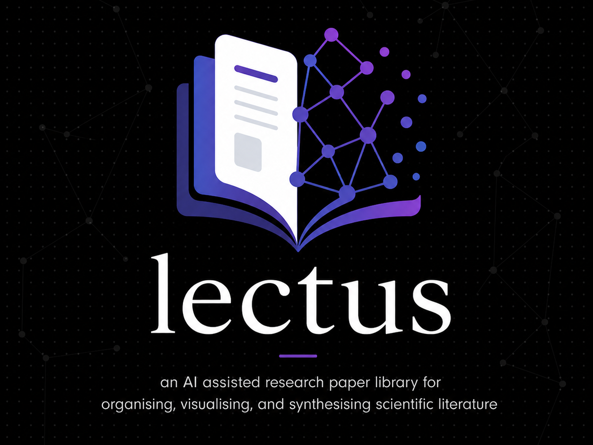

> _Lectus_ - Latin, "having been read."

Researchers read dozens of papers, but struggle to remember key findings and how studies connect. Knowledge becomes fragmented, and valuable time is lost re-reading and piecing insights together.

**Lectus** is an AI-assisted research copilot designed to solve this problem. It helps researchers organise, visualise, and synthesise scientific literature in one place. By combining a structured paper library with AI-powered analysis, Lectus enables users to quickly revisit prior knowledge, explore relationships between papers, and generate coherent literature summaries.

Built with React + Vite, Lectus uses the Anthropic API to extract metadata from PDFs, answer questions across your library, and draft literature-review paragraphs.

Lectus is a local-first desktop research assistant - your papers, notes, and API keys stay on your machine.

## Features

- **Library** searchable, taggable list of papers with read/reading/to-read status, personal notes, and quote highlights.
- **Graph** force-directed network of papers connected by shared tags.
- **Timeline** chronological view grouped by publication year.
- **Compare** side-by-side comparison of 2-4 papers across abstract, key findings, tags, highlights, and notes.
- **Ask** chat with Claude about your library (notes and highlights included as context).
- **Review** generate a literature-review paragraph or a structured synthesis (agreements / contradictions / gaps / future directions / per-paper contributions).
- **Add** drop a PDF, AI extracts title, authors, journal, year, DOI, tags, abstract, and key findings.
- **Persistent local storage** papers, notes, highlights, and theme preferences are saved to IndexedDB and survive refreshes.
- **Desktop app** runs as a packaged Windows `.exe` via Electron, fully local — no browser required.
- **Themes** Midnight, Parchment, Ocean, Forest. Custom accent colour.


## AI Providers

Lectus supports multiple AI backends. It uses a built-in free provider via **Puter.js** to start asking questions immediately, so there's no API key needed.

### Bring your own API key (recommended)
For higher performance and reliability, connect your own provider:

- Anthropic (Claude)
- OpenAI (coming soon)
- Additional providers (planned)

All AI usage is optional and configurable in the settings.


## How it works

Lectus combines structured data + AI:

PDF → metadata extraction → structured library
                           ↓
                     user query
                           ↓
                 relevant context
                           ↓
                      AI response

This enables:
- fast paper recall
- cross-paper synthesis
- structured literature reviews

## Quick start

```bash
npm install
npm run dev
```

## Project structure

```
electron/
├── main.cjs                 # Electron main process (BrowserWindow, dev/prod loader)
└── preload.cjs              # Preload bridge (currently empty, ready for IPC)

src/
├── api/
│   └── anthropic.js         # All HTTP calls to the Anthropic Messages API
├── components/
│   ├── AddView.jsx          # PDF dropzone
│   ├── ChatView.jsx         # Library Q&A
│   ├── CompareView.jsx      # Side-by-side comparison of 2-4 papers
│   ├── GraphView.jsx        # Force-directed tag network
│   ├── LibraryView.jsx      # Searchable list with sidebar filters
│   ├── PaperDetail.jsx      # Single paper: notes, highlights, status
│   ├── ReviewView.jsx       # Paragraph + structured literature review
│   ├── SettingsView.jsx     # Theme + accent picker, library stats
│   ├── TimelineView.jsx     # Year-grouped timeline
│   └── TopBar.jsx           # Logo + view tabs + settings cog
├── constants/
│   ├── prompts.js           # Centralised prompt templates (incl. structured)
│   ├── seedPapers.js        # Initial library content
│   ├── tagColors.js         # Stable colour-per-tag mapping
│   └── themes.js            # Midnight / Parchment / Ocean / Forest
├── hooks/
│   └── useDebouncedEffect.js # Debounce hook used by the IndexedDB writer
├── storage/
│   ├── db.js                # Tiny promise-wrapped IndexedDB key-value store
│   └── persistence.js       # Typed shims: loadPapers / savePapers / prefs
├── utils/
│   ├── format.js            # Tiny markdown renderer for chat
│   └── graph.js             # Edge builder + force-directed layout
├── App.jsx                  # State, persistence, view routing, AI handlers
├── index.css                # Base reset
└── main.jsx                 # React entry point
```

## Scripts

| Command                  | What it does                                                   |
| ------------------------ | -------------------------------------------------------------- |
| `npm run dev`            | Start the Vite dev server on port 5173.                        |
| `npm run build`          | Produce a production build in `dist/`.                         |
| `npm run preview`        | Preview the production build locally.                          |
| `npm run electron:dev`   | Launch Vite + Electron together (auto-reload, devtools open).  |
| `npm run electron:build` | Build the Vite bundle, then package a Windows `.exe` installer. |

## Desktop build

`npm run electron:build` outputs a Windows installer to `release/`. The default target is NSIS x64; tweak `build.win.target` in `package.json` to add `portable`, `msi`, or other architectures. Building Windows installers requires running on Windows (or wine).

## Persistence

Papers, notes, highlights, theme, and accent live in IndexedDB under the database name `lectus`. Wipe via DevTools → Application → IndexedDB → Delete to reset to the seed library. The schema is versioned (`SCHEMA_VERSION` in `src/storage/persistence.js`) so a future paper-shape migration won't load stale data.

## Notes

- The model is set in `src/api/anthropic.js` (`MODEL` constant). Bump it whenever you want a different Claude version.
- Structured review uses strict JSON output; if Claude wraps the JSON in prose or fences, the parser strips them automatically.

## License

See [LICENSE](LICENSE).
